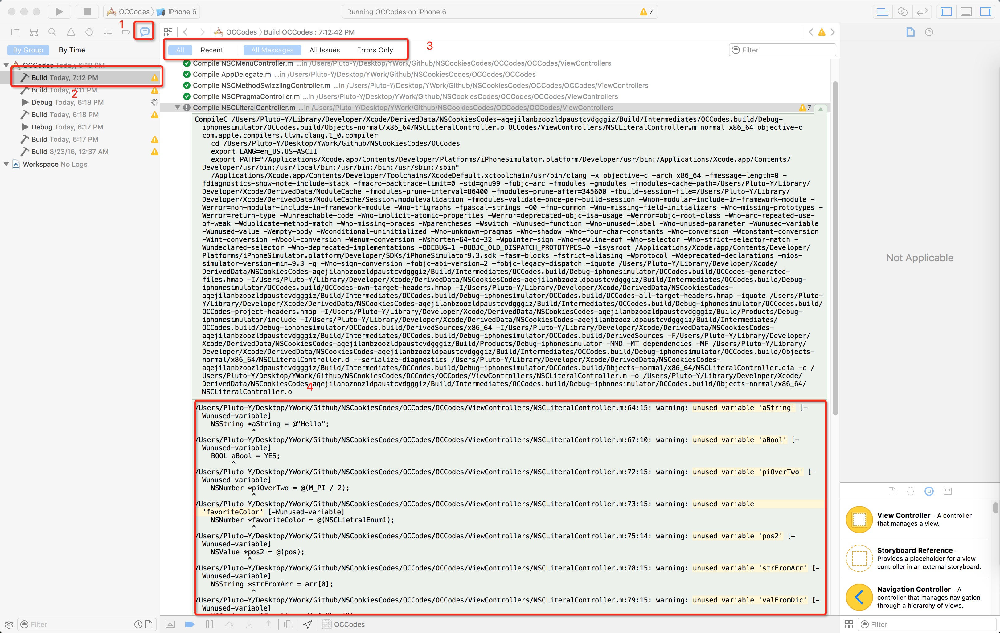

我去，就这两个东西还要讲？是OC或Swift开发人员都知道是怎么回事好吗?不就是用来标记和分组代码的吗？难道还有别的装逼技能？

当然，其实问大部分人说这两个是什么作用，或者是除了这两个还知道什么的情况下。很多人都只知道这两个是用来组织代码的。然而这样说也对也不对，确实我们常用的情况是都是用这两个来组织代码的，但是如果看过很多开源的人肯定看过一下的形式的代码：

```
#pragma clang diagnostic push
#pragma clang diagnostic ignored "-Warc-retain-cycles"
.... //一些代码
#pragma clang diagnostic pop
```

那么这些代码是拿来干嘛的呢？且听我慢慢道来。

确实在我们日常工作中，经常用到`#pragma mark`或者`// MARK:`来组织代码，并且大家都知道组织代码有两种形式: 一种是用来分组，一种是用来标注。具体如何展示大家也当我废话，看下下面的代码吧：

```
// Objective-C 代码
- (void)viewDidLoad {
    [super viewDidLoad];
    [self initAll];
}

#pragma mark Custom functions
- (void)initAll {
    ...
}

#pragma mark - UITableViewDataSources
- (NSInteger)tableView:(UITableView *)tableView numberOfRowsInSection:(NSInteger)section {
    return 10;
}

- (UITableViewCell *)tableView:(UITableView *)tableView cellForRowAtIndexPath:(NSIndexPath *)indexPath {
    return [[UITableViewCell alloc] initWithStyle:UITableViewCellStyleDefault reuseIdentifier:@"CELL"];
}

#pragma mark - UITableViewDelegate
- (void)tableView:(UITableView *)tableView didSelectRowAtIndexPath:(NSIndexPath *)indexPath {
    NSLog(@"点击了%li行", indexPath.row);
}
```

下面是`Swift`代码：

```
// Swift 代码
override func viewDidLoad() {
    super.viewDidLoad()
    initAll()
}

// MARK: Custom function
private func initAll() {
    ...
}

// MARK: - UITableViewDataSource
func tableView(tableView: UITableView, numberOfRowsInSection section: Int) -> Int {
    return 10
}

func tableView(tableView: UITableView, cellForRowAtIndexPath indexPath: NSIndexPath) -> UITableViewCell {
    return UITableViewCell(style: .Default, reuseIdentifier: "CELL")
}

// MARK: - UITableViewDelegate
func tableView(tableView: UITableView, didSelectRowAtIndexPath indexPath: NSIndexPath) {
    print("点击了\(indexPath.row)行")
}
```

那么效果呢，大家也都知道，就是下图这样：


其实主要就是两点，一个就是后面没有跟'-'的情况，这种情况就不会出现分组，只是当单纯的有注释，另一种就是带'-'的情况，那么这种情况就会添加一条水平分割线，也就是出现了分组。那么在我们写代码的过程中最好将代码相关性比较强的都分到同一个组别当中去。这样针对以后维护的人员对代码的也能跟快读懂代码。这也就是我们常说的要做注释，增加代码的可读性。

关于这个的用法就不多说了，大家去试试，并且大部分都知道这个特性。那么我们围绕着这个说说其他的特性吧，首先我们先来说说一个可以装逼的神器，就是用它来局部的控制某个警告的开启与关闭，也就是我们文章开头说的那个：

```
#pragma clang diagnostic push
#pragma clang diagnostic ignored "-Wunused-variable"
// 一段代码
#pragma clang diagnostic pop
```

估计很多小伙伴经常在很多开源代码里面可以看到这段代码，这个代码呢，其实就用来关闭警告的，这样在你有些写一些代码的时候需要忽略某些警告的时候特别有用。具体用法我们就用上面这个来试试吧。

```
#pragma mark - UITableViewDataSources
- (NSInteger)tableView:(UITableView *)tableView numberOfRowsInSection:(NSInteger)section {
#pragma clang diagnostic push
#pragma clang diagnostic ignored "-Wunused-variable"
    int unusedInt;
#pragma clang diagnostic pop
    return 10;
}
```

通过下面这段代码忽略没有使用`unsedInt`这个属性的警告了。那么问题来了，就有人问了：“我怎么知道后面那个"-Wunsed-variable"这个字符串应该是什么呢”？想知道吗？你猜啊，就不告诉你就不告诉你，就不告诉你！(pia~一脱鞋过来，这是三天不打上房揭瓦！)

好吧，其实有两种手段，一种就是网上有人整理了一个网站[Which Clang Warning Is Generating This Message?](http://fuckingclangwarnings.com/)，里面包含了许多警告抑制的字符串，大家可以参考一下。另外一个方案呢，就是通过Xcode来查找，具体步骤如下图:



先选择`Report Navigator`，然后选择最后一个日志，选择所有信息，然后去日志中查看你需要的警告信息，并且在哪里警告它都会罗列出来。通过这种手段，我们就可以装逼添加`#pragma clang diagnostic ignored`的信息了。

当然对于上面这种特殊的为使用的警告，还可以用下面这种形式来关闭警告：

```
// Objective-C 代码
NSString *unsedString;
#pragma unused(unsedString)
```

好了，学了这一招就可以在自己代码里面装逼了，那么我们在说说OC中还有哪些好用的功能呢？竟然说到警告，那么我们可以在说如何自己手动的产生警告吧，有两种方式，具体可以看下面的代码:

```
#pragma message "This is a warning"
#warning "This is another warning"
```

具体效果如何呢？看看下面这张图:


是不是觉得很神奇，其实在我们日常工作中可以通过这种代码为暂时还没有打算好填写内容的地方打上一个warnings,然后这样我们在我们写代码的过程中就可以注意到这些warning，这样之后我们就可以来填坑了。毕竟我是一个有代码洁癖的人，对于自己代码中有很多警告是完全不能够忍受的，希望大家也能养成这个习惯。  其实除了警告以外，还有一个`#error`可以用，大家可以尝试一下。

下面我们来说说在`Swift`中除了`MARK`以外我们还可以用什么呢：其实还有两个我们可以用的，在大家写Swift过程中可以用到`// TODO:`与`// FIXME:`相当于OC中只有警告来指定，我更喜欢Swift中的这种用法，因为它的目的性更明确，其用法与`MARK`一致，具体用法和效果就看下面吧:


具体内容就到此为止吧，深入的地方就等你们告诉我了哟。感谢大家的阅读，退下吧，朕要洗白白去了。