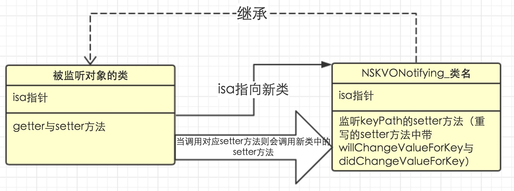

刚看到这个名字估计很多人有点熟悉，`Method Swizzling`对不对，不熟悉也没关系，去看看之前的一篇文章[黑魔法之Method Swizzling](http://www.nscookies.com/method-swizzling/)吧。不过也可以根据名称猜测出来所谓的`isa-swizzling`就是讲`isa`进行替换了的技术。如果有小伙伴问我什么是`isa`的话，不好意思，保安，有人来捣乱，拖出去~(开玩笑，关于什么是`isa`的话，大家可以去看看网络上很多关于OC的对象模型的文章)。

那么，既然是`isa`替换，那主角当然就是`isa`啦。那么这个技术出现在什么场景呢？其实这个技术在官方文档中关于[KVO的文档中](https://developer.apple.com/library/ios/documentation/Cocoa/Conceptual/KeyValueObserving/Articles/KVOImplementation.html)有提到过, 里面说到了，KVO是通过`isa-swizzling`来实现的。

> Automatic key-value observing is implemented using a technique called isa-swizzling.

> The isa pointer, as the name suggests, points to the object's class which maintains a dispatch table. This dispatch table essentially contains pointers to the methods the class implements, among other data.

> When an observer is registered for an attribute of an object the isa pointer of the observed object is modified, pointing to an intermediate class rather than at the true class. As a result the value of the isa pointer does not necessarily reflect the actual class of the instance.

> You should never rely on the isa pointer to determine class membership. Instead, you should use the class method to determine the class of an object instance.

最后一段中也说到了，永远不要用用`isa`来判断一个类的继承关系，而是应该用`class`方法来判断类的实例。

看着好像很厉害的技术耶~(双眼bling~bling~发光)。那么为了验证这个技术真正的实现了，也就是`isa`替换了，我们写了下面一段代码来验证。大家一起来观摩一下：

```
// 这里用来说明printInfo方法都做了说明
@implementation Person

- (void)printInfo {
    NSLog(@"isa:%@, supper class:%@", NSStringFromClass(object_getClass(self)), class_getSuperclass(object_getClass(self)));
    NSLog(@"self:%@, [self superclass]:%@", self, [self superclass]);
    NSLog(@"age setter function pointer:%p", class_getMethodImplementation(object_getClass(self), @selector(setAge:)));
    NSLog(@"name setter function pointer:%p", class_getMethodImplementation(object_getClass(self), @selector(setName:)));
    NSLog(@"printInfo function pointer:%p", class_getMethodImplementation(object_getClass(self), @selector(printInfo)));
    
}

@end

// 既然是KVO嘛，那我们就来模拟一个虚假的KVO的情况，并且打印对应的信息
Person *person = [[Person alloc] init];
NSLog(@"Before add observer--------------------------------------------------------------------------");
[person printInfo];
[person addObserver:self forKeyPath:@"age" options:NSKeyValueObservingOptionNew context:&PrivateKVOContext];
NSLog(@"After add observer--------------------------------------------------------------------------");
[person printInfo];
[person removeObserver:self forKeyPath:@"age"];
NSLog(@"After remove observer--------------------------------------------------------------------------");
[person printInfo];
```

> 根据之前一篇[历史冤案之isKindOfClass与isMemberOfClass](http://www.nscookies.com/runtime-objectmodel/)中提到，object_getClass其实打印的就是isa指针。

其中第一个Person的实现中，我们打印了`isa`, `supperclass`, 两个方法的`setter`的函数指针以及`printInfo`的函数指针。而运行代码中分别在添加Observer前，添加Observer以及删除Observer后分别打印出该类的信息。那么输出的结果是什么呢？

```
Before add observer--------------------------------------------------------------------------
isa:Person, supper class:NSObject
self:<Person: 0x7ffe5aeeb340>, [self superclass]:NSObject
age setter function pointer:0x10fe03c40
name setter function pointer:0x10fe03be0
printInfo function pointer:0x10fe03a30
After add observer--------------------------------------------------------------------------
isa:NSKVONotifying_Person, supper class:Person
self:<Person: 0x7ffe5aeeb340>, [self superclass]:NSObject
age setter function pointer:0x10ff04c7f
name setter function pointer:0x10fe03be0
printInfo function pointer:0x10fe03a30
After remove observer--------------------------------------------------------------------------
isa:Person, supper class:NSObject
self:<Person: 0x7ffe5aeeb340>, [self superclass]:NSObject
age setter function pointer:0x10fe03c40
name setter function pointer:0x10fe03be0
printInfo function pointer:0x10fe03a30
```

我们可以分别对比一下添加Observer前以及添加Observer之后(同样也可以比较添加Observer之后与删除Observer之后)，我们发现`isa`, 通过`class_getSuperclass`, 以及`age`的`setter`方法都发生了变化。而且我们发现其添加Observer之后的`class_getSuperclass`得到的结果竟然是`Person`, `isa`竟然是`NSKVONotifying_Person`。 What the hell?这是在逗我？

不对，看看文章的标题，其实在添加KVO之后，`isa`已经替换成了`NSKVONotifying_Person`,而根据`class_getSuperclass`得到的结果竟然是`Person`, 然后`age`是使我们KVO需要观察的属性，它的`setter`函数指针变了。而我们也知道，所谓的OC的消息机制是通过`isa`去查找实现的，那么我们现在可以进行大胆的猜想：

其实KVO的实现可能是：

* 添加Observer
  * 通过runtime偷偷实现了一个子类，并且以`NSKVONotifying_`+类名来命名
  * 将之前那个对象的isa指针指向了这个子类。
  * 重写了观察的对象setter方法，并且在重写的中添加了`willChangeValueForKey:`以及`didChangeValueForKey:`
* 移除Observer
  * 只是简单的将其的isa指向原来的类对象中

然后我们在分析一下， 在真正调用的`setAge:`的情况下, 根据消息机制我们知道它先通过`isa`找到对应对象的类， 也就是现在`NSKVONotifying_Person`, 然后再去找`setAge:`，由于`NSKVONotifying_Person`这个对象重写了这个方法， 那么就会直接取当前的实现， 也就是带有`willChangeValueForKey:`以及`didChangeValueForKey:`， 那么自然就实现了对KVO的实现了。

最后在看看一幅图吧，稍微总结一下`isa-swizzling`是搞什么东东：



最后就酱紫了，退下吧，朕要翻牌子了~哇哈哈

> PS:具体代码可以从[Github](https://github.com/NSCookies)上获取。

> 如有问题或纠正, 可以联系[@叫什么都不如叫Pluto-Y](http://weibo.com/plutoy0504)或在[Github](https://github.com/NSCookies)