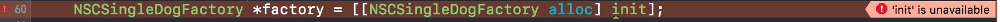

"你问我爱你有多深, 我爱你有几分, 我的情不移, 我的爱不变, 月亮代表我的心"，既然月亮代表我的新，是不是说明了我的要私有你？哈哈开玩笑，我们来说一个装逼的东西~

我们在写OC的过程中经常有这么一种情况，就是我们需要写一个单例的情况。当然我们都会提供一个类方法类似于`+(instancetype)sharedInstance`之类的方法，巴特(but)我们的类的开山鼻祖都是`NSObject`,而这个鼻祖竟然提供了`- (instancetype)init`让别人来调用。这样宝宝就不开心了，宝宝很委屈，可是宝宝不说，我就是想让别人调用我的类方法来获得单例嘛~(呕吐~)

那么我们有没有办法让`init`方法私有化呢？或者是让小伙伴不要去调用它呢？答案是木有，因为我们知道OC没有私有化父类方法的做法，并且OC有非常强大的Runtime机制，致使我们没有办法私有化`init`方法。通常这个时候都会有个但是，要不然还写这篇文章干嘛。

其实虽然没有完全私有`init`的方法，但是我们可以通过一些手段来私有化它，让我们来一个一个的看看吧。

首先，我们可以用Clang的Attributes中的unavailable来让产生一个编译错误。怎么做呢？简单的要命,只要添加如下的声明即可:

```language-objectivec
- (instancetype)init __attribute__((unavailable("Disabled. Use +sharedInstance instead")));
```

那么会产生什么效果呢？


个人比较喜欢第一种，特别是在写一些开源的情况下，能在其他小伙伴调用的时候就直接给出编译错误。而且也能给出有用的信息提示小伙伴调用其他的方法进行替代。

第二种，通过使用`NS_UNAVAILABLE`来声明，具体使用方法与第一种类似:

```language-objectivec
- (instancetype)init NS_UNAVAILABLE;
```

效果如下：



而这种方式也是产生了一个编译错误，只是这种方式没有办法给出更加具体的提示信息，而细心的小伙伴可以发现，第二种方式的提示信息和第一种方式很像，为什么呢？我们来看看关于`NS_UNAVAILABLE`的定义:

```language-objectivec
#if !defined(NS_UNAVAILABLE)
#define NS_UNAVAILABLE UNAVAILABLE_ATTRIBUTE
#endif
```

我们可以从名字`UNAVAILABLE_ATTRIBUTE`看的出来，它应该也是用到了`__attribute__`只是应该提示信息是空字符串，应该等价于下面这两种情况，至少从展现的形式上来看应该是等价的。

```language-objectivec
- (instancetype)init __attribute__((unavailable));
- (instancetype)init __attribute__((unavailable));
```

第三种是在`init`方法中调用`doesNotRecognizeSelector`来搞定，也非常简单，大概如下

```language-objectivec
- (instancetype)init {
    [super doesNotRecognizeSelector:_cmd];
    return nil;
}
```

这种方法则会在调用的时候抛出一个类似于"unrecognized selector"信息的错误。这种形式其实没有直接指明真正的原因，可能会让用户丈二和尚摸不着头脑的赶脚，可能分分钟给你差评，所以这种方法可能会被以欺君罪分分钟被分尸~

第四种则是在`init`中通过断言或者异常的形式来让用户在运行的时候crash来提示用户，这个点很像第三点，但是通过断言或者异常我们可以通过给出相对应的错误信息提示用户来用其他方式来替代的方法，代码可以如下:

```
// 通过断言
- (instancetype)init {
    NSAssert(false,@"unavailable, use sharedInstance instead");
    return nil;
}

// 或者通过异常
- (instancetype)init {
    [NSException raise:NSGenericException
                format:@"Disabled. Use +[%@ %@] instead",
     NSStringFromClass([self class]),
     NSStringFromSelector(@selector(sharedInstance))];
    return nil;
}
```

这种方式虽然能提示正确的信息，可是用户必须要到运行的时候才能看到错误的信息，所以个人感觉还是偏迟了一点。

小小的总结一下，虽然提供了四种方式，但是本来还是喜欢第一种方式，毕竟第一种方式能在编译的过程中就能获得有用的信息，让其他的小伙伴即使使用正确的方式。好啦，就酱紫啦，小伙伴可以自己去动手尝试一下了~

> PS:具体代码可以从[Github](https://github.com/NSCookies)上获取。

> 如有问题或纠正, 可以联系[@叫什么都不如叫Pluto-Y](http://weibo.com/plutoy0504)或在[Github](https://github.com/NSCookies)