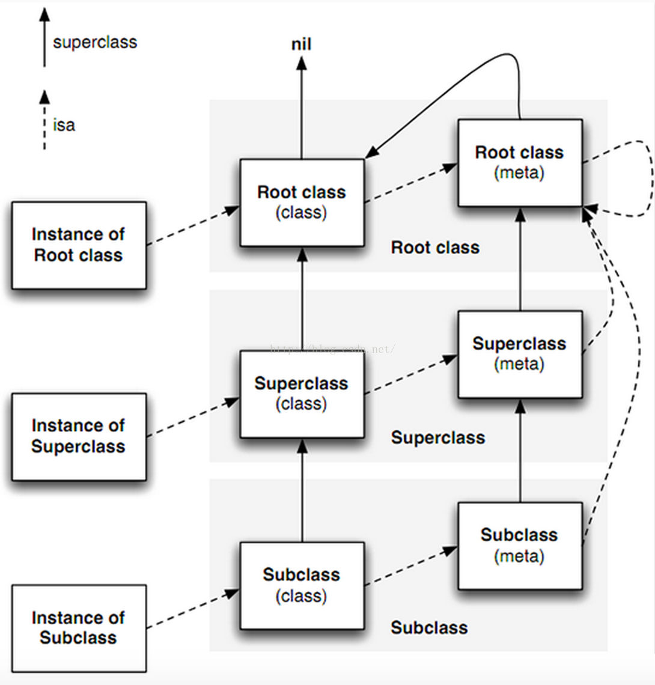

开封有个包青天，铁面无私辩忠奸。话说在那峨眉山上有个尼姑庵(诶，怎么串戏了)。咳咳，不好意思，忘记吃药了。进入今天的主题吧，为什么说历史冤案呢？其实也说不上怨，跟窦娥比起来，它还好得很呢。

其实这次跟大家讲的是很多人都知道的OC的对象模型，也就是下面这张图，大家先有个印象先：



然后我们看看它的“冤”在哪，先来看一段代码吧。

```language-objectivec
BOOL res1 = [(id)[NSObject class] isKindOfClass:[NSObject class]];
BOOL res2 = [(id)[NSObject class] isMemberOfClass:[NSObject class]];
BOOL res3 = [(id)[Pluto class] isKindOfClass:[Pluto class]];
BOOL res4 = [(id)[Pluto class] isMemberOfClass:[Pluto class]];
```

> 这段代码来自[@sunny大神](http://weibo.com/u/1364395395?is_all=1)的博客里的文章——[神经病院objc runtime入院考试](http://blog.sunnyxx.com/2014/11/06/runtime-nuts/)。（并对其中做了一些修改）里面还有其他的三道题，其中第二道和第三道题的原因有异曲同工之妙。

而很多人都会认为，这明显是四个`YES`,因为我们不是平常说`isKindOfClass`就是用判断前面是不是后面那个的子类或者就是那个类，而`isMemberOfClass`就是用来判断前面那个是不是就是后面那个类型的。非也非也，正确的说话应该前面那个"实例"是否是后面那个类型的（针对`isKindOfClass`和`isMemberOfClass`），或者是任何前面那个"实例"是否是后面那个类型或者是那个子类型。
下面来看看苹果官网是如何描述的：

> isKindOfClass: Returns a Boolean value that indicates whether the receiver is an instance of given class or an instance of any class that inherits from that class.

> isMemberOfClass: Returns a Boolean value that indicates whether the receiver is an instance of a given class.

为什么这里的实例加了引号呢，其实是这样的，我们常说的实例都是指左边那一列，而其实这里提到的实例不当是指左边这一列，还包含中间这一列。我们可以这样说我们通常认为的实例是`Class`的实例，而苹果官网中的文档还有另一重意思就是`Class`其实是`Meta Class`的实例。

不好意思这里有点绕，我们举一个实际的🌰。就说说前面这个板栗吧，这个板栗是一个具体的实例，而他的`Class`则应该是板栗这个类别，而板栗有是具有某一特性的植物，而这里指的某一特性的植物则是板栗这个`Class`的`Meta Class`，大家好好去体会一下。

接下来说说`NSObject class`和`object_getClass`之间的区别，咋一看很多人觉得这个不是应该是同一个东西吗，其实非也非也，且听我慢慢说来。其实`NSObject class`这个方法获得的永远是中间这个`Class`的级别，而`object_getClass`通常都是用来获得isa指向的那个，不行我们用下面这段代码来试试：

```language-objectivec
BOOL res5 = [NSObject class] == [[NSObject class] class];
BOOL res6 = [NSObject class] == [[[NSObject class] class] class];
BOOL res7 = [NSObject class] == object_getClass([NSObject class]);
BOOL res8 = object_getClass([NSObject class]) == object_getClass(object_getClass([NSObject class]));
BOOL res9 = [NSObject class] == class_getSuperclass(object_getClass([NSObject class]));
```

其中5和6其实不管调用多少次的`class`方法都会返回`YES`，而5和7说明了`class`方法和`object_getClass`方法是不一样的，而根据文章开头的图片以及前面说到`object_getClass`是isa指向的那个可以得出8和9都是`YES`。

好了，到这里要是都理解的话，我们最后在来看看苹果官方中关于`isKindOfClass`方法和`isMemberOfClass`的[源码](https://opensource.apple.com/source/objc4/objc4-532.2/runtime/NSObject.mm):

```language-objectivec
+ (BOOL)isMemberOfClass:(Class)cls {
    return object_getClass((id)self) == cls;
}

- (BOOL)isMemberOfClass:(Class)cls {
    return [self class] == cls;
}

+ (BOOL)isKindOfClass:(Class)cls {
    for (Class tcls = object_getClass((id)self); tcls; tcls = class_getSuperclass(tcls)) {
        if (tcls == cls) return YES;
    }
    return NO;
}

- (BOOL)isKindOfClass:(Class)cls {
    for (Class tcls = [self class]; tcls; tcls = class_getSuperclass(tcls)) {
        if (tcls == cls) return YES;
    }
    return NO;
}
```

看到这里很多童鞋要说"Holy Shit", 然而本宝宝不喜欢说粗话的小盆友， 来人啊， 把说出话的人拖出去斩了（不用这么狠吧！）。好吧，没错，苹果官方关于这两个方法都提供了实例方法和类方法。而我们最开始的Demo调用的都是类方法，再加上我们前面说的`object_getClass`的含义以及第一副关于对象模型的图片得知，res1的路径为`Root Class->Root Meta Class -> Root Class`，所以返回的是`YES`。同理可证res2, res3, res4为`NO`。

> 上面老是说因为所以让我想起以前正面题目的`∴`,`∵`还有同理可证什么的，看来我还是一个爱学习的好孩子嘛(偷笑)。

> PS:具体代码可以从[Github](https://github.com/NSCookies)上获取。