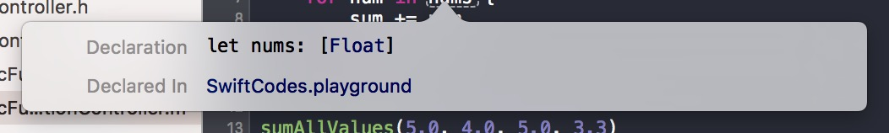

在OC中最常用的函数之一应该就是NSLog这个输出函数了，作为有好奇心的新青年，我“手贱”的点进了NSLog的声明里看到了下面的声明：

```
FOUNDATION_EXPORT void NSLog(NSString *format, ...) NS_FORMAT_FUNCTION(1,2);
```

这个代码然我瞬间感觉好熟悉，想起了之前Java中的[可变参数函数](https://en.wikipedia.org/wiki/Variadic_function)。可是再仔细一看就发现，尼玛后面的可变参数竟然是没有参数名，而且也没有类型之类的信息，瞬间我就懵逼了。

于是我就找了我的大哥--谷歌，经过一番查找之后发现其实也不是特别难。乍一看虽然跟Java中将参数默认识别为一个具体类型的数据完全不同，但是其实还是换汤不换药，其实只是我们将Java中帮我们做的那一份我们自己实现了而已。

其实说是OC的可变参数的实现不如说是C的可变参数的实现，因为OC是C的超集，而且在许多方面来说OC并没有完全的摆脱C的影子。好了不废话了，看招：

```language-objectivec
// 可变参数的实现
-(NSNumber *)sumAllValues:(NSNumber *)initValue, ... {
    va_list args; // 1.
    va_start(args, initValue); // 2.
    NSNumber *arg = va_arg(args, NSNumber *); // 3.
    NSNumber *result = initValue;
    float sum = [result floatValue];
    while (arg != nil) {
        sum += [arg floatValue];
        arg = va_arg(args, NSNumber *); // 4.
    }
    va_end(args); // 5.
    result = @(sum);
    return result;
}
```

可以看出其实我们只是将`Java`帮我们做的事情让我们自己做而已。也不是特别难嘛。
这里稍微给大家讲解一下：

* 1.声明了一个变量用来装可变参数,其类型是在C中定义的va_list, 其本质上来说是一个指针
* 2.调用C函数va_start, 其第一个参数是将可变参数的第一个参数的指针传递给该参数，第二个参数指明了可变参数是跟在哪个参数之后的
* 3、4.都是用来去多参数的下一个参数的C函数，其第一个参数传递的是1中声明的变量，第二个参数是讲多参数的数据转换成什么类型，其实这个好像是`forin`的形式
* 5.在遍历完可变参数之后记得要调用va_end来表明结束，并且释放该变量

其实这个过程很想是在写原生`sqlite3`的时候，获取数据之后进行遍历数据的情况。需要去某个地方(`va_start`第二个参数之后的位置)"获取"数据，然后遍历数据，最后结束的时候还要关闭“数据库”(释放变量)的感觉。是不是很简单？

那么接下来我们再看看`Swift`是如何实现的，更简单的就来了~

```language-swift
func sumAllValues(nums: Float...) -> Float {
    var sum: Float = 0.0
    for num in nums {
        sum += num
    }
    return sum
}

sumAllValues(5.0, 4.0, 5.0, 3.3)
```

有没有觉得很像是一个语法糖一样，只是将可变参数转换成一个数据，于是我又一次手贱的查看了一下`nums`的类型:



看出来没，其实所谓的可变参数都是骗子。就不能少一点套路，多一点真诚吗？其实就是讲所谓的可变参数编程了一个`Array`了。所以总体来说`Swift`的可变参数函数实现起来就是讲可变参数变成了数组。

然而其实在OC中大部分情况下没必要用到`可变参数函数`, 我们可以用`NSArray`等集合工具来实现即可。并且用集合来实现相对更安全一点。毕竟用集合可以通过集合的许多属性和方法来做一些特殊的处理和判断。所以，切记可变函数参数在极少的情况下才会用到，大部分情况我们只要了解其中的实现以及看见的时候知道是怎么回事即可。

> PS:具体代码可以从[Github](https://github.com/NSCookies)上获取。

> 如有问题或纠正, 可以联系[@叫什么都不如叫Pluto-Y](http://weibo.com/plutoy0504)或在[Github](https://github.com/NSCookies)