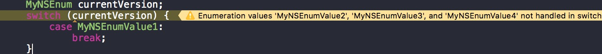
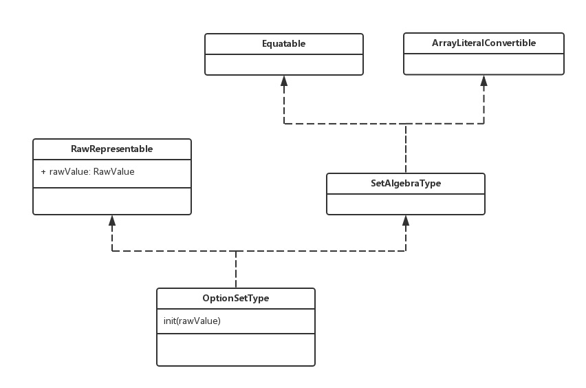

枚举估计是大家工作中经常打交道的一种类型，那么在OC和Swift中我们经常如何用它的呢？综合多方面的使用，我们大体可以将枚举分为两种方式，一种是普通的枚举，还有一种不普通的枚举(我屮艸芔茻，你这不是废话吗~)，诶，第二种应该说是枚举中的各种可能同时存在，如果换成代码的语言就是枚举中的各个值有可能进行位操作运算的。那么在代码里面分别如何表示呢？

OC中将这两种分别用`NS_ENUM`与`NS_OPTIONS`来区分，而Swift中则用普通的enum以及`OptionSetType`来搞定。那么该如何使用以及在使用过程中有什么需要注意的呢？且听下回分解(分解你大爷啊！)

咳咳，首先我们先来看看`NS_ENUM`以及`NS_OPTIONS`是个什么东东吧~

```
#if (__cplusplus && __cplusplus >= 201103L      \
        && (__has_extension(cxx_strong_enums)   \
        || __has_feature(objc_fixed_enum))      \
    ) ||                                        \
    (!__cplusplus && __has_feature(objc_fixed_enum))
        #define NS_ENUM(_type, _name) enum _name : _type _name; enum _name : _type
    #if (__cplusplus)
        #define NS_OPTIONS(_type, _name) _type _name; enum : _type
    #else
        #define NS_OPTIONS(_type, _name) enum _name : _type _name; enum _name : _type
    #endif
#else
    #define NS_ENUM(_type, _name) _type _name; enum
    #define NS_OPTIONS(_type, _name) _type _name; enum
#endif
```

其实呢，他就是一个宏定义。那么我们来一个一个的分析每个宏定义是如何生效的。假设我们写下下面这段话:

```
typedef NS_ENUM(NSUInteger, MyNSEnum) {
    MyNSEnumValue1,
    MyNSEnumValue2,
    MyNSEnumValue3,
    MyNSEnumValue4
};
```

那么通过上面的宏定义应该就会变成下面这段话:

```
// 情况一：如果满足上面一堆的条件
typedef enum MyNSEnum : NSUInteger;
enum MyNSEnum : NSUInteger {
    //具体内容
};
// 情况二：如果不满足上面一堆的条件
typedef NSUInteger MyNSEnum;
enum {
    //具体内容
};
```

可以看出来`NS_ENUM`是做到向下兼容了，在一些低版本的，不兼容一些特性的情况下则用情况二的方式来定义枚举，而在新版本的情况下，则采用情况一来定义。当然对于上面一些条件，有兴趣的小伙伴可以自己查查资料了解一下。

估计还有一部分小伙伴习惯直接用enum之类的来定义枚举，但是还是建议大家尽量用`NS_ENUM`以及`NS_OPTIONS`，毕竟苹果提供了这个新的特性，而且它也支持了向下兼容。并且现在大家的都习惯性用这个，如果写这个也方面大家读懂以及直观看懂是`NS_ENUM`还是`NS_OPTIONS`。而且这也是目前许多网站和数据推荐的做法，也是一个共识。（路人甲：我就不用，我就不用，你特么来打我啊~）额，你老大，你了不起咯。

那么除了这个好处以外还有没有什么其他的好处呢？在switch块中，我们如果用到的是`NS_ENUM`的话，尽量不要用`default:`，这样的话如果没有写全所有的枚举类型的话，会出现warning，这样也方便了我们如果在使用`枚举+switch`的过程中，如果添加了一个新的枚举的值，那么同时也会出现warning。就像下图:



然后普通的枚举就尽量用`NS_ENUM`。对于那些可以同时存在的，比如一些配置项，一些控制某些事件的开关之类的枚举我们就尽量用`NS_OPTIONS`，例如我们在用`NSCalendarUnit`，还有动画里面的`UIViewAnimationOptions`以及`Autoresizing`里面用到的`UIViewAutoresizing`都是`NS_OPTIONS`类型，而这种类型我们经常都会用位操作符来进行控制。

我们从UIKit中看下`UIViewAutoresizing`吧，代码如下:

```
typedef NS_OPTIONS(NSUInteger, UIViewAutoresizing) {
    UIViewAutoresizingNone                 = 0,
    UIViewAutoresizingFlexibleLeftMargin   = 1 << 0,
    UIViewAutoresizingFlexibleWidth        = 1 << 1,
    UIViewAutoresizingFlexibleRightMargin  = 1 << 2,
    UIViewAutoresizingFlexibleTopMargin    = 1 << 3,
    UIViewAutoresizingFlexibleHeight       = 1 << 4,
    UIViewAutoresizingFlexibleBottomMargin = 1 << 5
};
```

而通常`NS_OPTIONS`都是这样定义的，即通过所需的类型在二进制中的某一个位置的不为0来进行操作，这样也方便了我们通过或(或者与)来进行控制那些属性是需要的，那些属性不需要的来进行不同的操作。

看完OC中的做法，那么我们来看看Swift中是怎么操作的呢？估计普通的枚举大家都用到烂了，就是enum了，那我就不多说废话了，对于`NS_OPTIONS`在Swift中的替代方案是什么呢？

如果用过Swift1.2的小伙伴估计想到了以前用的Xcode snippet，通常都是这个:

```
struct <# Options #> : RawOptionSetType, BooleanType {
    let rawValue: UInt
    init(nilLiteral: ()) { self.value = 0 }
    init(_ value: UInt = 0) { self.value = value }
    init(rawValue value: UInt) { self.value = value }
    var boolValue: Bool { return value != 0 }
    var rawValue: UInt { return value }
    static var allZeros: <# Options #> { return self(0) }

    static var None: <# Options #>         { return self(0b0000) }
    static var <# Option #>: <# Options #>     { return self(0b0001) }
    // ...
}
```

看到这里，估计小伙伴可以体会到在1.2的时候那酸爽真是够了，如果自己手写一行一行的敲，估计好浪费时间啊。所以之前都是通过用Xcode snippet来进行操作的。而在2.2中我们有事如何写的呢？我们来尝试一下：

```
struct NSCOptions : OptionSetType {
    let rawValue: UInt
    static let None = NSCOptions(rawValue: 0)
    static let Value1 = NSCOptions(rawValue: 0b0001)
    static let Value2 = NSCOptions(rawValue: 0b0010)
    static let Value3 = NSCOptions(rawValue: 0b0100)
    static let Value4 = NSCOptions(rawValue: 0b1000)
}
```

发现没相对Swift1.2简洁了不是一点两点，是不是很高兴。好哒，妹子上来亲我一口吧~（pia~流氓）。咳咳，言归正传，是不是比之前方便很多，那么我们来看下`OptionSetType`是什么鬼？



可以看得出来左边这个就是我们经常enum中用来创建的构造方法，右边这个从最上面说起，上面的`Equatable`是用来判等用的，也就是我们经常用的`!=`和`==`的协议，而右边这个则是我们之前说过的字面量里面的数组字面量(关于字面量一节小伙伴们可以看看[字面量(Literal)]())，也就是我们可以用`[]`来表示一组Options的集合，而不是通过`|`来表达，这样用起来也更加人性化。而`SetAlgebraType`则提供了集合的操作，比如并集，交集，异或，插入等等。这里就不对他们进行深究了，放过他们吧。俗话说得好，冤冤相报何时了~

好了，最终关于枚举我们就说到这里吧，剩下的小伙伴们可以自己去玩玩。不过别玩出火哟~

> PS:具体代码可以从[Github](https://github.com/NSCookies)上获取。

> 如有问题或纠正, 可以联系[@叫什么都不如叫Pluto-Y](http://weibo.com/plutoy0504)或在[Github](https://github.com/NSCookies)