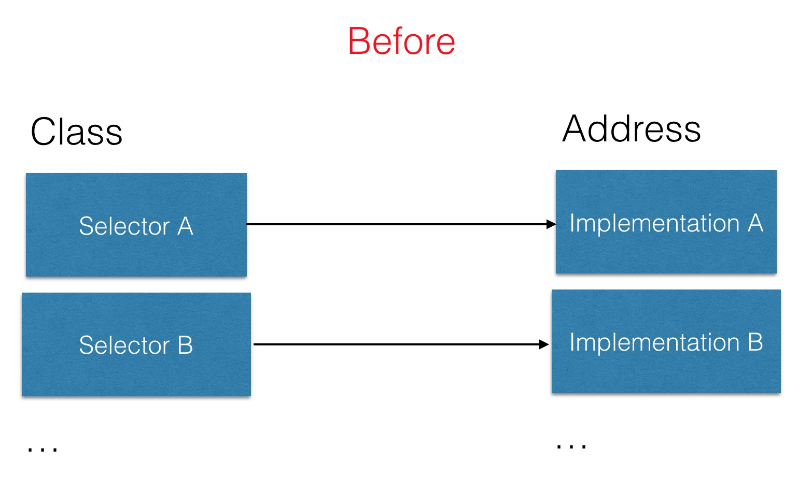
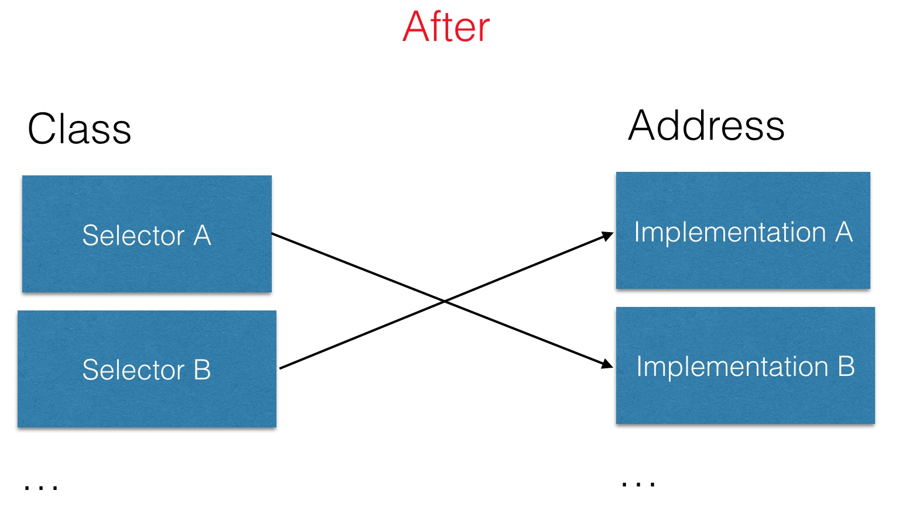

> 背景：一手抓住女神，一首抓住楼主

> “移形换影大法”

> 几秒钟后...

> “讨厌，死相，这什么武功嘛，好厉害的呢，好厉害的呢！”

> “pia~，赶紧说正题”（一脱鞋过来！）

咳咳，其实今天要说的这个，估计很多童鞋看到这个名字就知道是什么了。对了，这个就是大家最最熟悉的黑魔法之一。(其实也就是前面开头中用到的那个移形换影大法，人家没有不正经，只是举了个例子而已啦~嗲~)我们常说OC的动态性是OC的一大特点之一，其中非常好的一个例子就是这个`Method Swizzling`，用得好它能做出非常恶心的功能————如果Xcode很多插件。但是如果滥用的话，它也会造成非常大的麻烦————最明显的就是很多程序中莫名其妙的bug。

但是作为最为流行的黑魔法我们要知道，如果有童鞋做安全，逆向或者hack别人App，那估计这个是基础的基础了吧。并且很多开源库中都用了这个“魔法”，所以知道这个还是非常有必要的。

我们知道OC底层的实现中，对象的实现方法都存在类中，存在一个叫做`objc_method_list`，而这里真正存储的是一个关于`函数名`、`参数列表`以及`函数实现的指针`的`dispatch table`。而其实真正的`Method Swizzling`的实现就是一个替换函数指针的过程。

怎么个替换方法呢？其实也非常简单， 看下下面两幅图就知道里面是怎么实现的了。
在没有交换前，`Class`中的两个方法对应的函数指针都是正常的，如下图：



而在交换后，其实就是将`Selector A`指向了`Implementation B`而`Selector B`则指向了`Implementation A`,如下图：


那么在交换后调用`Selector A`的情况下，其实跳转到了`Implementation B`的指针所指向的代码段。自然就形成了方法A与B的替换了。

那么具体代码是如何实现的呢？其实实现的方式有特别多种，不过我最喜欢下面这一种：

```language-objectivec
+ (void)swizzleWithOriginalSelector:(SEL)originalSelector swizzledSelector:(SEL) swizzledSelector isClassMethod:(BOOL)isClassMethod
{
    Class cls = [self class];
    
    Method originalMethod;
    Method swizzledMethod;
    
    if (isClassMethod) {
        originalMethod = class_getClassMethod(cls, originalSelector);
        swizzledMethod = class_getClassMethod(cls, swizzledSelector);
    } else {
        originalMethod = class_getInstanceMethod(cls, originalSelector);
        swizzledMethod = class_getInstanceMethod(cls, swizzledSelector);
    }
    
    if (!originalMethod) {
        NSLog(@"Error: originalMethod is nil, did you spell it incorrectly? %@", originalMethod);
        return;
    }

    method_exchangeImplementations(originalMethod, swizzledMethod);
}
```

既然知道了这个，那么我们来验证一下上面所说的指针的替换吧，看下下面的代码：
```language-objectivec
MethodSwizzlingDemo *methodSizzling = [MethodSwizzlingDemo new];
NSLog(@"Before swizzle method");
NSLog(@"methodOrigin pointer :%p", class_getMethodImplementation([MethodSwizzlingDemo class], @selector(methodOrigin)));
NSLog(@"methodSizzled pointer :%p", class_getMethodImplementation([MethodSwizzlingDemo class], @selector(methodSizzled)));
[methodSizzling methodOrigin];
[methodSizzling methodSizzled];

NSLog(@"------------------------------------------------------------------------------------");
[MethodSwizzlingDemo swizzleWithOriginalSelector:@selector(methodOrigin) swizzledSelector:@selector(methodSizzled) isClassMethod:NO];
NSLog(@"After swizzle method");
NSLog(@"methodOrigin pointer :%p", class_getMethodImplementation([MethodSwizzlingDemo class], @selector(methodOrigin)));
NSLog(@"methodSizzled pointer :%p", class_getMethodImplementation([MethodSwizzlingDemo class], @selector(methodSizzled)));
[methodSizzling methodOrigin];
[methodSizzling methodSizzled];
```

上面代码中前面一半为未替换前的关于个方法信息以及调用后的结果，而后面一半则为执行`Method Swizzling`之后个方法信息以及调用后的结果，其后台输出如下：

> Before swizzle method

> methodOrigin pointer :0x104ad46c0

> methodSizzled pointer :0x104ad4700

> -[MethodSwizzlingDemo methodOrigin]

> -[MethodSwizzlingDemo methodSizzled]

> ------------------------------------------------------------------------------------

> After swizzle method
 
> methodOrigin pointer :0x104ad4700

> methodSizzled pointer :0x104ad46c0

> -[MethodSwizzlingDemo methodSizzled]

> -[MethodSwizzlingDemo methodOrigin]

可以看出其中在为调用前，`methodOrigin`的指针为`0x104ad46c0`，而`methodSizzled`的指针为`0x104ad4700`,而在`Method Swizzling`之后这两个方法的指针调换了，从而实现了函数的“移形换影大法”。从后面的函数调用也可以看得出来。从而也证明了上面的图。

> "死鬼， 这下你明白了没？没明白晚上我们慢慢聊~嗲~"

`Method Swizzling`是一个非常强而有力的魔法，在非常多的开源以及hack代码中都有用到，我记得我第一次接触到这个是在了解如何写自己的Xcode plugin， 那时候觉得能写一个Xcode plugin是一个非常酷的事情。（喂偏题了！）好吧，关于这个下次有空再说。

虽然说`Method Swizzling`是一个非常强大的黑魔法，但是还是建议能不用的情况下就少用，毕竟如果在多人都在替换之后，整体的函数指针都会特别乱，特别是在用第三方库的情况下，很多库都替换来替换去，最终导致程序经常出现莫名其妙的错误，但是自己分析情况下又很难判断出是否替换过，寻找起来不是特别的方便。

> PS:具体代码可以从[Github](https://github.com/NSCookies)上获取。
